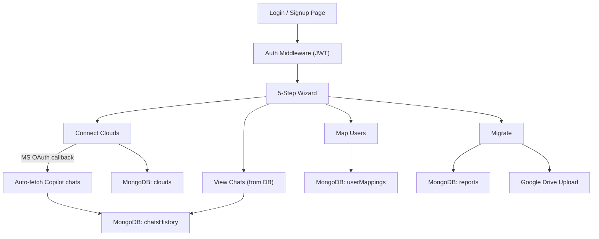

# MongoDB Integration Plan

## Current State

The app currently stores everything **in-memory** via `express-session` (default MemoryStore):
- Auth tokens in `req.session.sourceAuth` / `req.session.googleAuth`
- User mapping in `req.session.mapping`
- Migration results in `req.session.migrationResults` + a module-level variable

This means all data is lost on server restart. MongoDB will make everything persistent.

## Architecture



## MongoDB Collections

### 1. `users` - App authentication
```js
{
  _id: ObjectId,
  email: String,          // unique, lowercase
  passwordHash: String,   // bcrypt hashed
  displayName: String,
  createdAt: Date,
  lastLoginAt: Date
}
```

### 2. `clouds` - Connected cloud accounts
```js
{
  _id: ObjectId,
  userId: ObjectId,       // ref to users._id
  provider: "microsoft" | "google",
  accessToken: String,
  refreshToken: String,   // Google only
  account